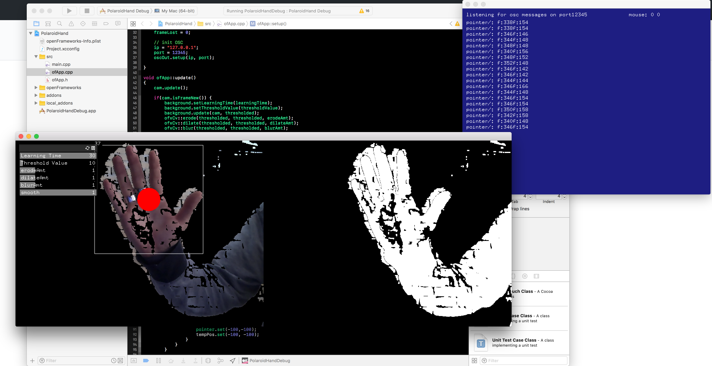

# SimpleHandTracking-OpenCV

Simple Hand Tracking with robust hand Haar Cascade just using a RGB camera and working with Background Substraction methods.
The pointer send OSC messages to localhost "Pointer/"

